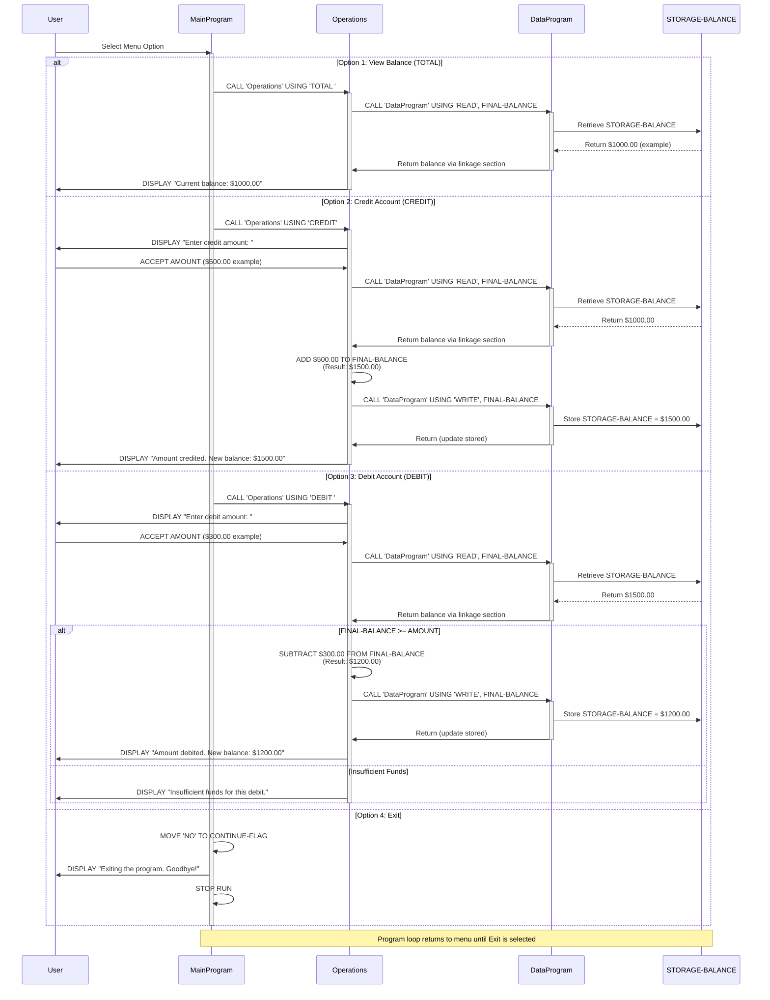

# Student Account Management System - COBOL Legacy Code Documentation

## Overview
This legacy COBOL system manages student account operations including balance inquiries, credit deposits, and debit withdrawals. The system is designed to handle basic account management with built-in validation for insufficient funds.

---

## COBOL Program Architecture

### 1. **MainProgram** (`main.cob`)

#### Purpose
Entry point for the Student Account Management System. Provides an interactive menu-driven interface for users to interact with their accounts.

#### Key Functions
- **Menu Display**: Shows four options to the user
  - View Balance (Option 1)
  - Credit Account (Option 2)
  - Debit Account (Option 3)
  - Exit (Option 4)
- **User Input Handling**: Accepts user choice and validates input
- **Program Control Flow**: Uses EVALUATE statement to route to appropriate operations
- **Loop Management**: Continues prompting until user selects exit

#### Data Items
- `USER-CHOICE` (PIC 9): Stores the user's menu selection
- `CONTINUE-FLAG` (PIC X(3)): Controls program loop (YES/NO)

#### Business Rules
- User must enter a valid choice (1-4)
- Invalid choices display an error message and re-prompt
- Program terminates only when user selects option 4 (Exit)

---

### 2. **Operations** (`operations.cob`)

#### Purpose
Processes all account transactions including balance queries, credit deposits, and debit withdrawals. Acts as the business logic layer between the UI and data layer.

#### Key Functions
- **Balance Inquiry (TOTAL)**: Retrieves and displays current account balance
- **Credit Operation (CREDIT)**: 
  - Accepts credit amount from user
  - Reads current balance
  - Adds credit amount to balance
  - Writes updated balance to storage
  - Displays new balance
- **Debit Operation (DEBIT)**:
  - Accepts debit amount from user
  - Reads current balance
  - Validates sufficient funds
  - If funds available: subtracts amount and updates storage
  - If insufficient funds: displays error and cancels transaction

#### Data Items
- `OPERATION-TYPE` (PIC X(6)): Type of operation to perform
- `AMOUNT` (PIC 9(6)V99): Transaction amount
- `FINAL-BALANCE` (PIC 9(6)V99): Current account balance (initialized to $1000.00)
- `PASSED-OPERATION` (PIC X(6)): Operation type parameter from MainProgram

#### Business Rules
- **Initial Balance**: All accounts start with $1000.00
- **Overdraft Prevention**: Debit transactions are rejected if insufficient funds
- **Balance Verification**: Balance is read from storage before each transaction
- **Immediate Updates**: Balance changes are written to storage immediately after credit/debit

---

### 3. **DataProgram** (`data.cob`)

#### Purpose
Handles persistent storage and retrieval of account balance data. Provides a data abstraction layer for other programs.

#### Key Functions
- **READ Operation**: Retrieves current stored balance from STORAGE-BALANCE
- **WRITE Operation**: Updates the stored balance with new value

#### Data Items
- `STORAGE-BALANCE` (PIC 9(6)V99): Persistent storage of account balance (initialized to $1000.00)
- `OPERATION-TYPE` (PIC X(6)): Type of data operation (READ/WRITE)
- `BALANCE` (PIC 9(6)V99): Parameter for balance values in linkage section

#### Business Rules
- Only READ and WRITE operations are supported
- All balance values are stored with 2 decimal places for currency precision
- Balance is maintained throughout the program session
- Changes are applied immediately

---

## System Flow Diagram

```
User
  ↓
MainProgram (Menu)
  ↓
Operations (Business Logic)
  ↓
DataProgram (Storage)
```

## Call Chain Example: Credit Transaction
```
MainProgram (User selects Option 2)
    ↓
Operations (CREDIT operation)
    ├─→ DataProgram (READ current balance)
    ├─→ ADD AMOUNT TO FINAL-BALANCE
    ├─→ DataProgram (WRITE new balance)
    ↓
Display new balance to user
```

---

## Key Business Rules for Student Accounts

1. **Initial Account Balance**: All student accounts are initialized with $1000.00
2. **Credit Operations**: Deposits are always accepted and added to the balance
3. **Debit Operations**: Withdrawals are only processed if sufficient funds are available
4. **Insufficient Funds**: If a withdrawal is attempted without sufficient balance, the transaction is rejected and balance remains unchanged
5. **Balance Precision**: All monetary values maintain 2 decimal places
6. **Real-time Updates**: All balance changes are immediately persisted in storage
7. **Session Persistence**: Balance changes persist during the program session
8. **Menu-Driven Interface**: Users interact through a numeric menu system

---

## Data Types and Formats

| Item | Type | Format | Purpose |
|------|------|--------|---------|
| USER-CHOICE | Numeric | PIC 9 | Menu selection input |
| CONTINUE-FLAG | Alphanumeric | PIC X(3) | Loop control (YES/NO) |
| OPERATION-TYPE | Alphanumeric | PIC X(6) | Operation identifier |
| AMOUNT | Numeric | PIC 9(6)V99 | Transaction amount ($0.00 to $999,999.99) |
| BALANCE | Numeric | PIC 9(6)V99 | Account balance ($0.00 to $999,999.99) |

---

## Error Handling

| Scenario | Current Behavior |
|----------|------------------|
| Invalid menu choice (not 1-4) | Display error message and return to menu |
| Insufficient funds for debit | Display error message and cancel transaction |
| User-entered invalid amount | Assumes input validation at OS level |

---

## Modernization Opportunities

- Implement proper error handling and exception management
- Replace hard-coded operation strings with constants
- Add logging and audit trails for transactions
- Implement input validation for numeric entries
- Convert to structured programming with proper encapsulation
- Support multiple concurrent users/accounts
- Add transaction history and reporting features
- Replace character-based UI with modern interface

---

## Data Flow Sequence Diagram



### Sequence Diagram Explanation

**Key Data Flow Patterns:**

1. **Menu-Driven Control**: User selections flow from MainProgram to Operations based on the numeric choice
2. **READ Operations**: When transaction data is needed, Operations calls DataProgram with 'READ' to retrieve current balance from storage
3. **Business Logic Processing**: Operations performs calculations (ADD for credit, SUBTRACT for debit) in memory
4. **WRITE Operations**: After calculations, Operations calls DataProgram with 'WRITE' to persist changes
5. **User Feedback**: Operations returns control to MainProgram which displays results to the user

**Balance Validation Flow (Debit Only):**
- Balance is read from storage before the transaction
- If sufficient funds exist: transaction proceeds and balance is updated
- If insufficient funds: transaction is rejected without updating storage
- This prevents account overdrafts
